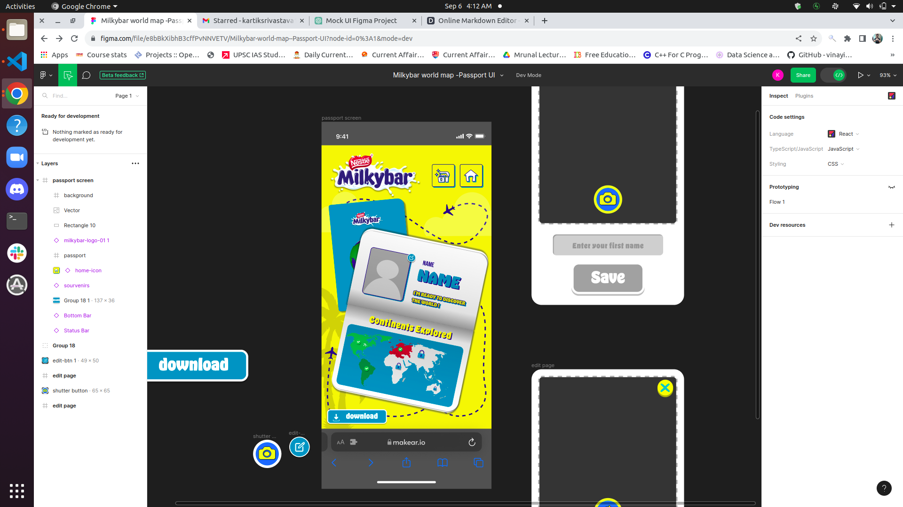
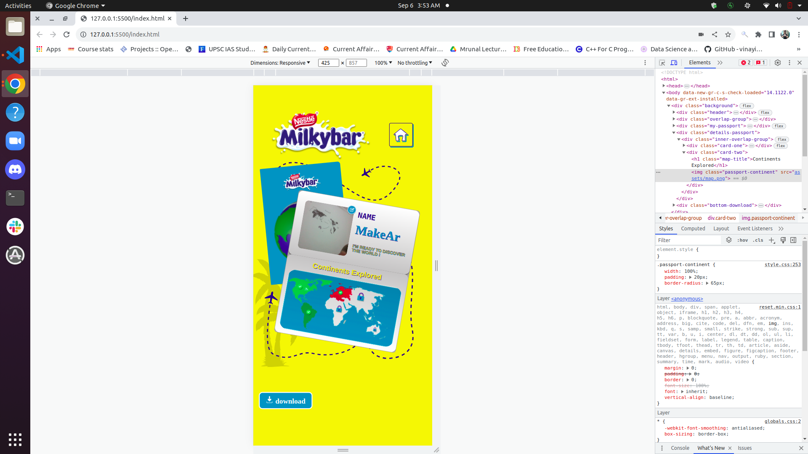
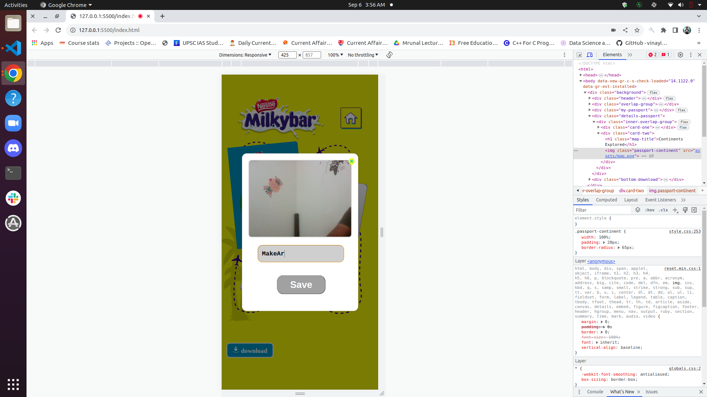

# Milkybar World Map Passport UI

Welcome to the Milkybar World Map Passport UI project, a stunning and interactive web-based simulation inspired by the Milkybar brand's whimsical aesthetics. This project impeccably replicates the Figma design available [here](https://www.figma.com/file/e8bBkXibhB3cffPvNNVETV/Milkybar-world-map--Passport-UI?node-id=0%3A152&mode=dev) and offers a delightful user experience with the following captivating functionalities:

## Features

### 1. Camera Integration
- Users can embark on a photographic adventure by simply tapping on the charming fallback image placeholder. This action triggers the camera to spring to life, ready to capture memorable moments.

   #### API Details
   - The camera functionality is achieved using the **MediaDevices API**, particularly the `navigator.mediaDevices.getUserMedia()` method. This API provides access to the user's camera and allows capturing images directly from the device's camera.

### 2. Image Capture and Storage
- With a single click, users can immortalize their memories and have the captured image seamlessly converted into a base64 format. The image is then saved to the local storage, preserving their cherished moments. Additionally, the new image immediately replaces the previous fallback image, ensuring a visually rich and personalized passport experience.

### 3. Name Editing
- Personalization is at the core of this project. Users have the ability to edit their name on the passport, allowing them to express their individuality and create a unique travel document.

### 4. Name Validation
- To maintain data integrity, the name input field is equipped with a sophisticated validation mechanism. It ensures that only alphabetic characters are accepted, and a maximum of 30 characters is allowed. Any deviation from these criteria prompts a user-friendly alert, guiding users toward a valid input.

### 5. Persistent Data
- The project goes the extra mile in enhancing user convenience. Entered names are diligently saved in local storage, guaranteeing that users' customized passports persist across sessions.

## Screenshots

### Screenshot 1: Passport with Fallback Image

Caption: This is the initial view of the passport with the fallback image.

### Screenshot 2: Camera Popup

Caption: The camera popup allows users to capture and save their own image.

## Getting Started

To embark on your virtual journey with the Milkybar World Map Passport UI, follow these steps:

1. Clone this repository to your local machine.
2. Open the `index.html` file in your preferred web browser.
3. Explore the captivating functionalities and start personalizing your Milkybar passport.

## Try It Live!

Experience the Milkybar World Map Passport UI by visiting the live project:
- [Live Project](https://thenarain.github.io/Milkybar-world-map--Passport-UI/)
- Dimensions: 425px * 857px

## Project Structure

### HTML Structure
- The HTML structure is meticulously designed within the `index.html` file, ensuring a visually engaging layout.

### JavaScript Functionality
- JavaScript wizardry brings this project to life. All interactive features are meticulously crafted in the `script.js` file, making user interactions seamless and delightful.

### CSS Styling
- The enchanting visual design is meticulously orchestrated in the `style.css` file. Every element is perfectly styled, capturing the Milkybar essence.

## UI Dimensions

- This UI is optimized for a dimension of 425px * 857px.
- Responsive features are still under development and will be added in future updates.

## Usage

1. **Open Camera Popup**: Click on the profile image to open the camera popup. Grant camera access when prompted.

2. **Capture and Save**: Capture your favorite moments by clicking the "Save" button within the camera popup. Your image will be converted into base64 format, saved in local storage, and immediately displayed as your profile picture.

3. **Name Personalization**: Edit your name by clicking on the name field. Express yourself and make your passport unique.

4. **Name Validation**: The name input field enforces strict validation rules. It accepts only alphabetic characters and restricts input to a maximum of 30 characters. Any invalid inputs trigger a helpful alert.

5. **Persistence**: Your entered name and captured image are stored in local storage, ensuring your personalized passport remains intact between sessions.

## Author

- Kartikay Srivastava

## License

This project is licensed under the MIT License. For more information, see the [LICENSE](LICENSE) file.

## Acknowledgments

- Milkybar for the delightful inspiration.
- Figma for the fantastic design.
- The web development community for their valuable insights and resources.

Thank you for joining us on this whimsical journey! Enjoy your Milkybar World Map Passport UI experience.
